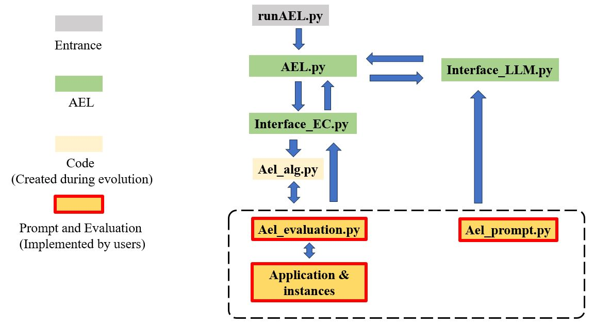
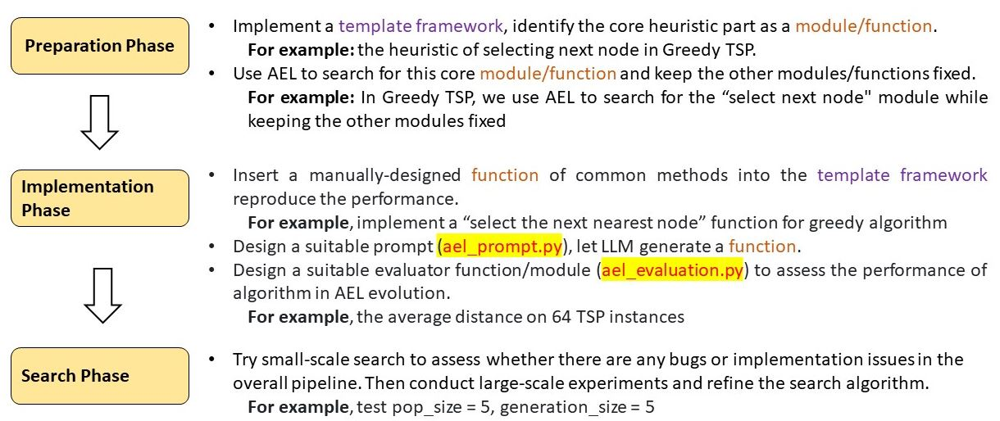

# How to apply Evolution of Algorithms to your own problem?

### Flowchart for AEL Code

### Files in example (What your should modify to fit your application)

The two "ael_evaluation.py" and "ael_prompts.py" in bold are to be designed by users depending on their applications

+ ael_alg.py: algorithm designed by AEL during algorithm evolution.

+ **ael_evaluation.py:** evaluation module for evaluation the algorithm, class name must be "Evaluation" includes a function named "evaluate", which returns the fitness value of algorithm.

+ **ael_prompts.py**:  the prompts designed by user

  + prompt_task: a description of your task
  + prompt_func_name: the name of python function, which implements the algorithm 
  + prompt_func_inputs: the inputs variables of the function (a list of strings)
  + prompt_func_outputs: the outputs variables of the function (a list of strings)
  + prompt_inout_inf: your explanation of the inputs and outpus
  + prompt_other_inf: other information you want LLM to know

+ runAEL.py: parameters and entrance 
+ app.py: interactive interface based on gradio (in developing)

### **A Brief Guide with Three Phases**

## Preparation Phase 

Avoid directly applying AEL methods for search !!!

+ Dos Identify several commonly used methods in your problem domain. You can select 3-5 methods based on "method performance" and "classical degree"; there is no need for too many.

+ Refine these common methods into a unified algorithm framework. For example, most evolutionary algorithms follow the framework below; note: (i) sometimes, to represent different algorithms in a unified framework, we may need to discard/adjust/re-implement some algorithm details; (ii) State-of-the-art algorithms usually use many tricks that may not be implementable in a unified framework. algorithm = GeneticAlgorithm( sampling=..., # e.g., LatinHyperCubeSampling() selection=..., # e.g., BinaryTournamentSelection() crossover=..., # e.g., SimulatedBinaryCrossover() mutation=..., # e.g., PolynomialMutation() survival=..., # e.g., SortByFitness() termination=..., # e.g., MaxGeneration() )

+ Under the unified framework, compare the core differences of these common methods in which module/function. For example: (i) Most multi-objective evolutionary algorithms differ primarily in the "survival" module; (ii) Most single-objective evolutionary algorithms differ in the way offspring are generated (i.e., "crossover" and "mutation" modules).

+ Use EoA to search for this core module/function and keep the other modules/functions fixed as a selection of common methods, which we typically call a template algorithm. Taking the design of multi-objective evolutionary algorithms as an example, we use EoA to search for the "survival" module while keeping the other modules fixed (i.e., not undergoing search), as shown below: algorithm = GeneticAlgorithm( sampling=LatinHyperCubeSampling(), selection=BinaryTournamentSelection(), crossover=SimulatedBinaryCrossover(), mutation=PolynomialMutation(), survival=To be Searched by EoA, termination=MaxGeneration() )

## Implementation Phase 

Insert functions of common methods into the template algorithm and see if the performance of the method can be largely reproduced. For example, if we insert "NonDominatedSorting + CrowdingDist" as the "survival" function in the template mentioned above, this algorithm should be able to roughly reproduce the performance of NSGA-II.

It is recommended to use ChatGPT's GPT-3.5 as the LLM used in the debugging phase, as it balances affordability (cheaper than GPT-4), effectiveness (better performance than most open-source LLMs and other commercial LLMs), and ease of use (no need for local deployment).

Designing a suitable evaluator function/module to assess the performance of EoA is crucial for its success, referred to as the "Sandbox" in DeepMind's paper. This evaluator theoretically needs to reflect the evolved algorithm's real/generalized performance across a series of relevant practical problems, i.e., to prevent overfitting to the test problems used in the search.

Use the LLM to randomly generate some samples (e.g., 1,000 - 10,000 samples depending on your computing power) for evaluation, and analyze: The performance distribution of these randomly generated samples, i.e., mean, std, etc.; How many of these randomly generated samples contain valid or invalid functions? i.e., functions that cannot be executed or take too long to execute (e.g., with an infinite loop); How many unique/duplicate functions are in these randomly generated samples? Uniqueness should reflect the algorithm's behavior, not just surface implementation; The average time required for the generation and evaluation of these randomly generated samples? These statistical results will help you gain a more intuitive understanding of the problem (such as understanding the search difficulty) and provide you with an intuitive sense of the LLM's performance on this problem.

## Search Phase 

It is recommended to first use an existing search method (as is, without any changes) for the search, such as FunSearch / EoA.
Start with a small-scale search to assess whether there are any bugs or implementation issues in the overall pipeline. Conduct large-scale experiments and refine the search algorithm.

